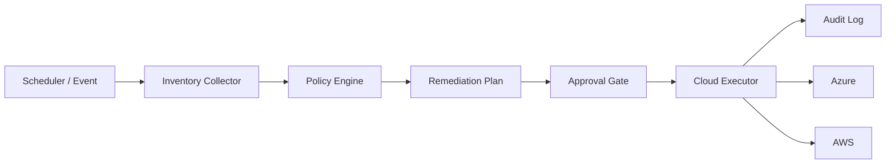

# Cloud Operations Architecture

The policy layer is intentionally separated from provider adapters so the same operational rule can be tested once and executed consistently across clouds.

High-impact actions should require explicit approval, least-privilege credentials, idempotent execution, and structured audit output.
